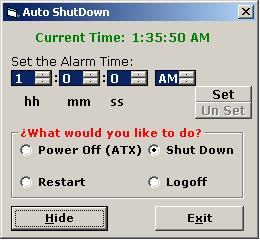



## Auto Shutdown/Restart Computer with Alarm

### Description

This code.. let you set the time.. and at that certain time this code will shutdown / restart / logoff your computer as you select it from options.. also it will tell you how to add systray icon.. well commented..
 
### More Info
 

             |
---                |---
**Submitted On**   |2002-08-22 01:36:40
**By**             |[Dhaval Faria](https://github.com/Planet-Source-Code/PSCIndex/blob/master/ByAuthor/dhaval-faria.md)
**Level**          |Beginner
**User Rating**    |5.0 (10 globes from 2 users)
**Compatibility**  |VB 5\.0, VB 6\.0
**Category**       |[Coding Standards](https://github.com/Planet-Source-Code/PSCIndex/blob/master/ByCategory/coding-standards__1-43.md)
**World**          |[Visual Basic](https://github.com/Planet-Source-Code/PSCIndex/blob/master/ByWorld/visual-basic.md)
**Archive File**   |[Auto\_Shutd1207768212002\.zip](https://github.com/Planet-Source-Code/dhaval-faria-auto-shutdown-restart-computer-with-alarm__1-38161/archive/master.zip)

